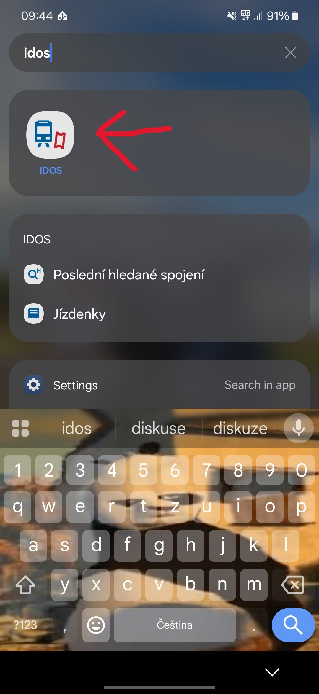
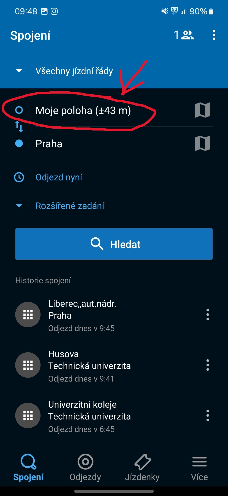
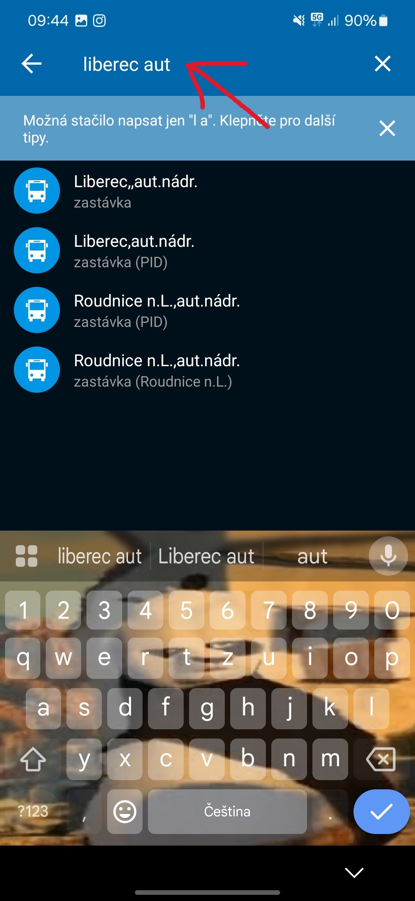
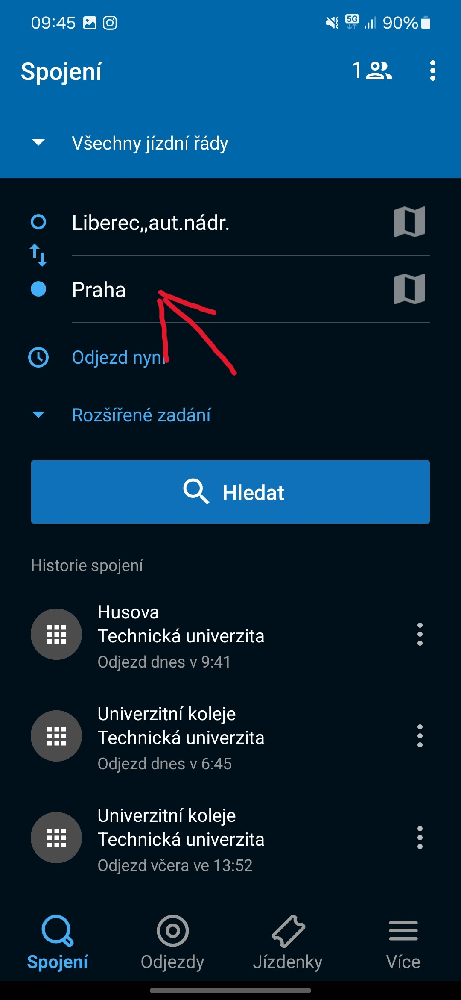
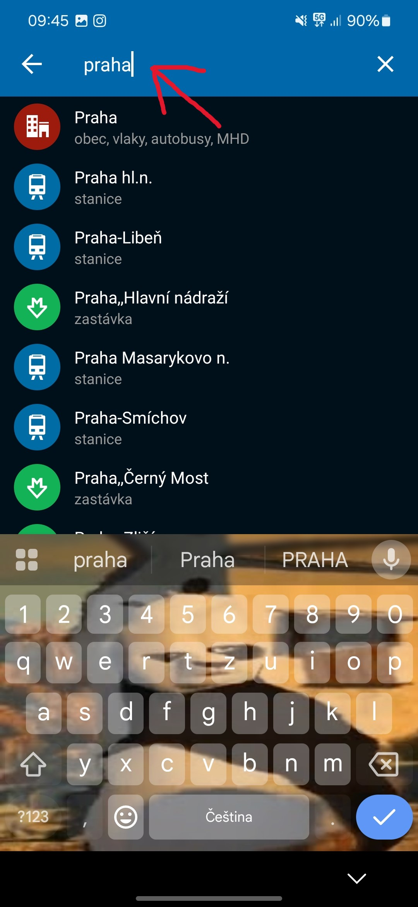
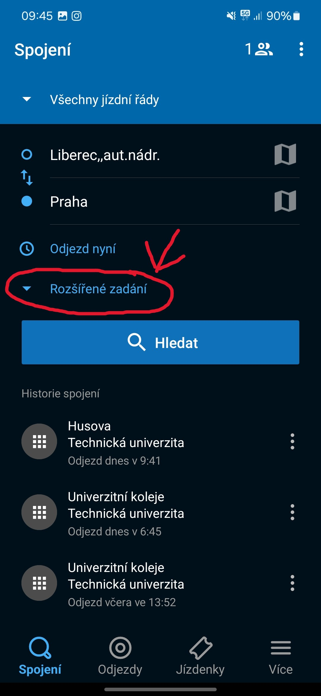
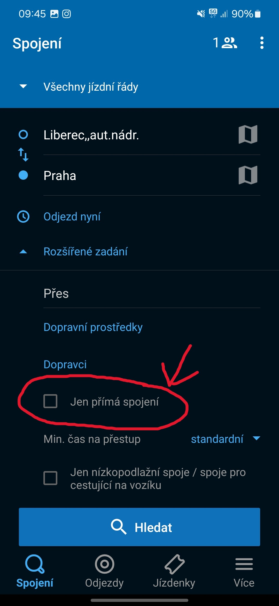
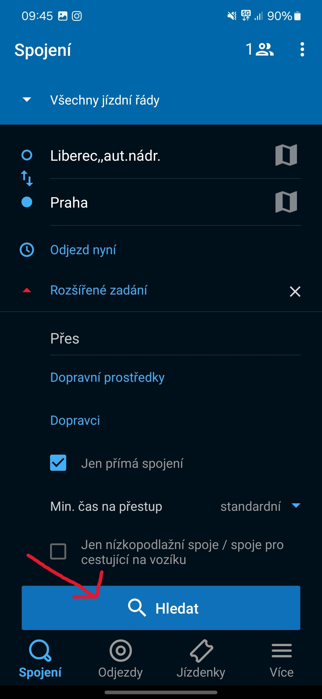
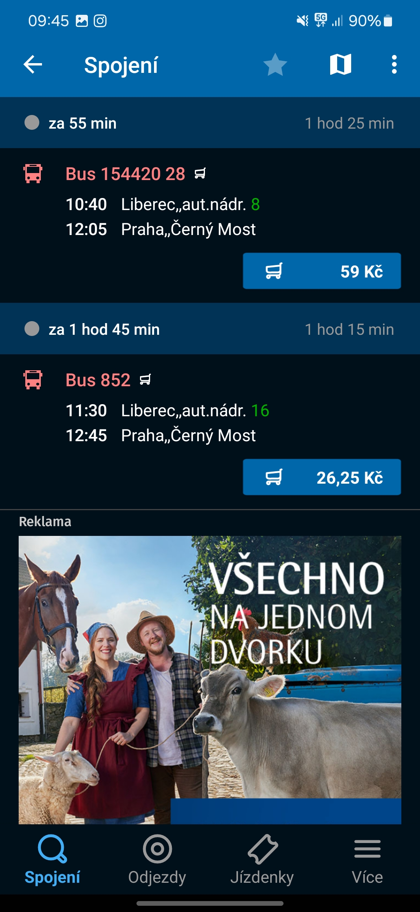

# Jak zjistit, kdy jede nejbližší bus do Prahy

- Zprvu je potřeba mít nainstalovanou aplikaci IDOS. Webové rozhraní je podobné tomu v aplikaci, ale není totožné.

- Aplikaci můžete najít na [Google Play](https://play.google.com/store/apps/details?id=cz.mafra.jizdnirady&hl=cs&pli=1) nebo [App Store](https://apps.apple.com/cz/app/j%C3%ADzdn%C3%AD-%C5%99%C3%A1dy-idos/id473503749?l=cs)

## Krok 1
- Nalezněte aplikaci na Vašem telefonu a otevřete ji.

## Krok 2
- Otevřeme pole z jaké zastávky chceme jet. 

## Krok 3 
- Vyplníme název zastávky/města/zvolíme naši polohu. (Pro demonstraci v tomto návodu byla vybrána zastávka autobusového nádraží Liberec)

## Krok 4 
- Otevřeme pole kam chceme jet. 

## Krok 5
- Vyplníme název zastávky. (Pro demonstraci v tomto návodu bylo vybráno město Praha)

## Krok 6 
- Pokud nechcete další rozšířené možnosti, můžete rovnou přeskočit na [Krok 8](#krok-8). Pokud chcete, klikněte na tlačítko na obrázku.

## Krok 7 
- Zvolte přímá spojení pro přímý autobus do Prahy. Můžete zde volit další filtry, ale pro účely demonstrace nejsou validní.

## Krok 8
- Klikněte na tlačítko hledat pro nalezení autobusu

## Krok 9
- Na obrazovce máte vypsané spoje.
