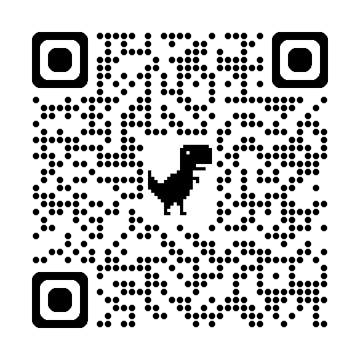

# PDO dokumentace - Kávovar

## Zákazník - manuál
- Přijít k automatu
- Stisknout zelené tlačítko na displeji pro zahájení výběru nápoje
- Volitelné: Výběr dávkování cukru v nápoji
- Vybrat nápoj
- Placení:
    - *Kartou:* Vyčkejte na audio zpětnou vazbu a po výzvě přiložte platební kartu/Zařízení s NFC platbami na displej zařízení
    - *Hotově:* Pokud to model automatu povoluje, vkládejte mince do vyhrazeného otvoru automatu. Povolené mince jsou 1kč, 2kč, 5kč, 10kč, 20kč, 50kč. U této metody placení následně odeberte zbytkovou vrácenou hotovost.
- Počkat na vyzvání pro odebrání nápoje
- nadzvednout průhledná dvířka a vzít si svůj kelímek
- Volitelné: Vzít si plastové víčko pro možnost vzít si nápoj bezpečně s sebou

## Zásobování - manuál
- Vypnutí: Před zahájením doplňování vypněte automat a odpojte jej od elektrické sítě, aby nedošlo k úrazu elektrickým proudem.
- Otevření automatu: Pomocí klíče nebo speciálního nástroje otevřete přední panel automatu, abyste získali přístup k zásobníkům na suroviny.
- Kontrola a čištění: Zkontrolujte, zda nejsou zásobníky nebo dávkovací mechanismy ucpané. Pokud ano, vyčistěte je podle pokynů výrobce. Například násypku na předemletou kávu lze vyprázdnit nožem, jak je popsáno v návodu.
    - Doplňování surovin:
          - Zrnková káva: Sejměte víko ze zásobníku na zrnkovou kávu a nasypte požadované množství zrn. U některých modelů můžete zvětšit kapacitu zásobníku pomocí nástavce. 
          - Instantní káva a další přísady: Otevřete příslušné zásobníky a nasypte do nich instantní kávu, mléčný prášek, cukr či jiné ingredience podle potřeby. Ujistěte se, že používáte správné množství a typ surovin doporučený výrobcem.
- Uzavření automatu: Po doplnění všech surovin zavřete a zajistěte přední panel automatu.
- Zapnutí: Připojte automat zpět k elektrické síti a zapněte jej.

## Údržbář - manuál
- Vypnutí: Před zahájením doplňování vypněte automat a odpojte jej od elektrické sítě, aby nedošlo k úrazu elektrickým proudem.
- Otevření automatu: Pomocí klíče nebo speciálního nástroje otevřete přední panel automatu, abyste získali přístup k zásobníkům na suroviny.
- Údržba: Proveďte kontrolu systémů výroby a podávání nápoje, zkontrolujte opotřebení dílů. Velmi poškozené vyměňte, opotřebené poznamejte do zprávy pro příští bližší kontrolu.
  - Zkontrolujte funkčnost vyměněných nebo opravených dílů
  - Pokud oprava v terénu nebyla dostatečná, nahlašte závadu nadřízenému a ten zařídí převoz automatu do servisního střediska
- Uzavření automatu: Po doplnění všech surovin zavřete a zajistěte přední panel automatu.
- Zapnutí: Připojte automat zpět k elektrické síti a zapněte jej.

## Uklízečka - manuál

Údržba:

- Před čištěním, pokud je to možné, přístroj vypněte.
- Dávejte pozor na horké části a případně používejte ochranné rukavice.

Denní čištění:
- Vyprázdněte a vyčistěte odkapávací mřížku a zásobník na odpad.
- Otřete vnější plochy kávovaru vlhkým hadříkem.
- Zkontrolujte hladinu vody (pokud je to vaše povinnost) a případně doplňte.

Týdenní čištění:
- Otřete místa, kde se mohou hromadit nečistoty, dle pokynů údržbaře.

Vyvarujte se:
- Zasahování do technických nastavení ani do vnitřních částí, ke kterým máte omezený přístup.
- Používání agresivních čisticích prostředků – dodržujte doporučené produkty.
- Pokud se objeví něco neobvyklého, neprovádějte zásahy, ale nahlaste to.

Nahlášení závad:

- V případě jakýchkoli problémů, závad nebo neobvyklých zvuků ihned kontaktujte údržbaře nebo nadřízeného.
