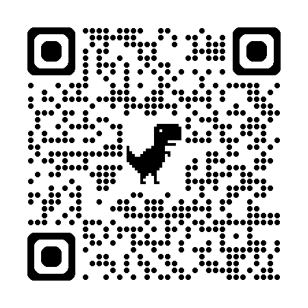

## Chatovací aplikace

## Kritéria
- Šifrování
- Délka zpráv
- Možnost speciálního formátování zpráv 
- Možnost posílání příloh
- Velikost samotných příloh - pokud jsou podporovány
- Typy chatů - (skupinové, soukromé, hovorové, textové)

## Kandidáti
- Messenger
- WhatsApp
- Telegram
- Discord
- Beeper

| Aplikace   | Šifrování                                   | Délka zpráv                             | Speciální formátování zpráv | Posílání příloh | Max. velikost příloh     | Typy chatů                                         |
|------------|----------------------------------------------|------------------------------------------|-------------------------------|------------------|---------------------------|----------------------------------------------------|
| **Messenger** | End-to-End      | Max. 20 000 znaků                        | Omezené (tučné, emoji, reakce) | Ano              | Do 25 MB                  | Soukromé, skupinové, textové, hlasové, video       |
| **WhatsApp**  | E2EE              | Max. 65 536 znaků                        | Omezené (tučné, kurzíva, přeškrtnutí) | Ano           | Do 2 GB                   | Soukromé, skupinové, textové, hlasové, video       |
| **Telegram**  | Proprietární MTProto security protocol   | Prakticky neomezená (4096 znaků na zprávu, ale lze řetězit) | Ano (Markdown, HTML) | Ano        | Do 2–4 GB (pro premium)   | Soukromé, skupinové, textové, hlasové, video       |
| **Discord**   | Šifrování při přenosu (TLS), ne E2E           | Max. 2000 znaků na zprávu                | Ano (Markdown)                | Ano              | Do 10 MB (50 - 500 MB pro Nitro) | Soukromé, skupinové, textové, hlasové, video       |
| **Beeper**    | Závislé na připojené síti (agreguje různé)    | Dle propojené služby                     | Dle propojené služby           | Ano              | Dle propojené služby       | Soukromé, skupinové, textové, hlasové (dle služby) |

